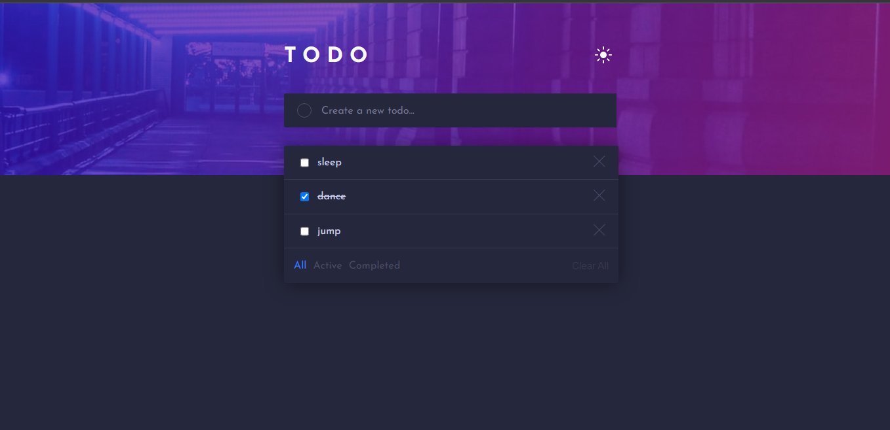
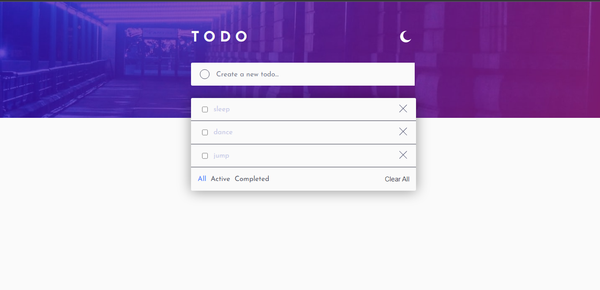
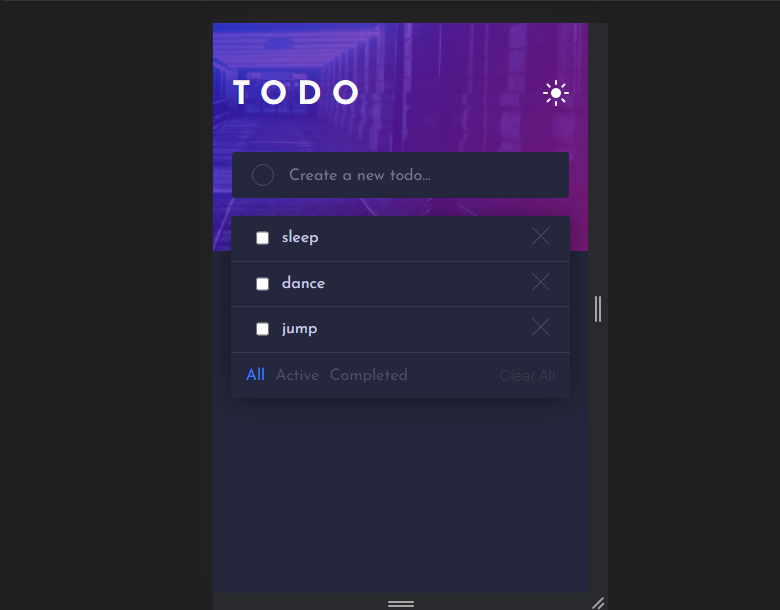

# Frontend Mentor - Todo app solution

This is a solution to the [Todo app challenge on Frontend Mentor](https://www.frontendmentor.io/challenges/todo-app-Su1_KokOW). Frontend Mentor challenges help you improve your coding skills by building realistic projects. 

## Table of contents

- [Overview](#overview)
  - [The challenge](#the-challenge)
  - [Screenshot](#screenshot)
  - [Links](#links)
  - [Built with](#built-with)
  - [What I learned](#what-i-learned)
- [Author](#author)
- [Acknowledgments](#acknowledgments)

## Overview

FEM Todo app challenge

### The challenge

Users should be able to:

- View the optimal layout for the app depending on their device's screen size
- See hover states for all interactive elements on the page
- Add new todos to the list
- Mark todos as complete
- Delete todos from the list
- Filter by all/active/complete todos
- Clear all todos
- Toggle light and dark mode

### Screenshot

.png)

### Links

- Solution URL: [Git repo url](https://github.com/Plut0r/todo-app)
- Live Site URL: [Netlify live url](https://todo-app-plut0r.netlify.app/)

### Built with

- Semantic HTML5 markup
- CSS custom properties
- Flexbox
- Javascript

### What I learned

I learnt more on how to use localStorage to add, delete and edit.

## Author

- Frontend Mentor - [@Plut0r](https://www.frontendmentor.io/profile/Plut0r)
- Linkedin - [@Plutor](https://www.linkedin.com/in/plut0r)

## Acknowledgments

- Coding Nepal - [youtube-video](https://www.youtube.com/watch?v=2QIMUBilooc)
- Clever Programmer - [youtube-video](https://www.youtube.com/watch?v=KA_8eOIsjn4&t=6937s)

